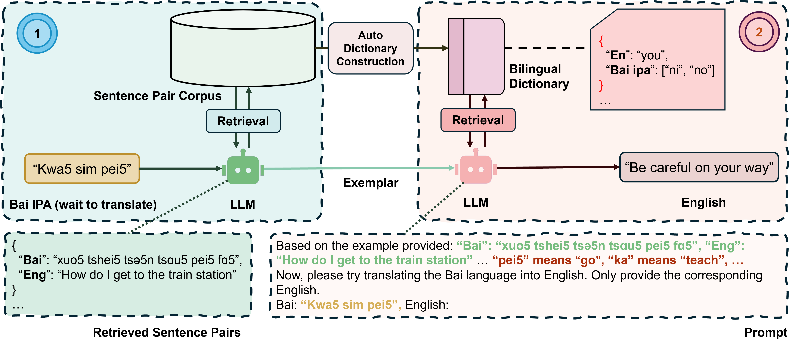
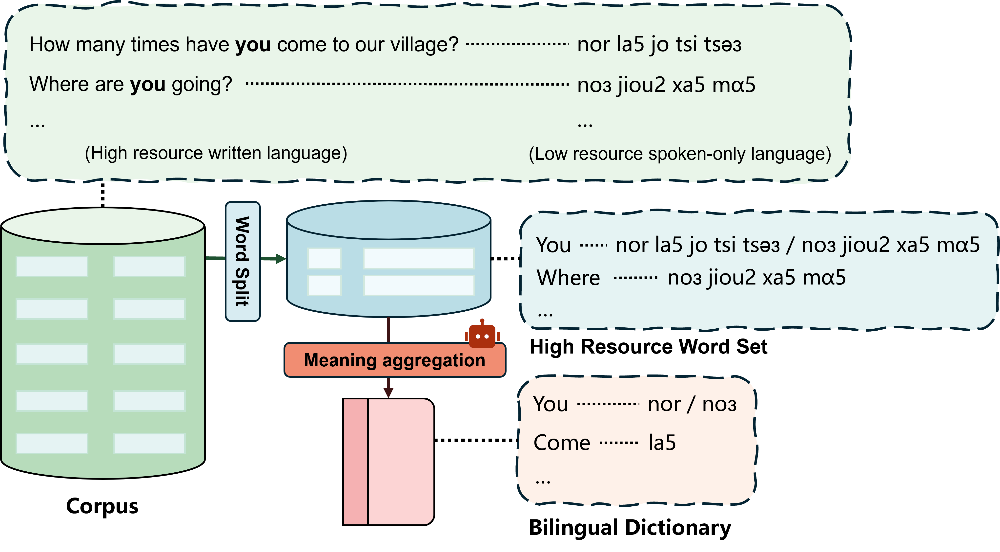

# 🌍 Can Large Language Models Translate Spoken-Only Languages through International Phonetic Transcription?

[ 🤗Huggingface ]
> coming soon

This work introduces two key contributions to address the challenges of applying LLMs to spoken-only languages:

1. **UNILANG Framework**: A novel approach that enables LLMs to translate spoken-only languages using IPA as an intermediate representation.
2. **SOLAN Dataset**: The first large-scale bilingual dataset featuring a spoken-only language, Bai, with aligned Chinese and English translations.


## 🧠 UNILANG Framework

UNILANG is the first framework designed to help LLMs understand and translate spoken-only languages by leveraging **automatic dictionary construction** and **knowledge retrieval**.





### Backbone

- Qwen2.5 
- Llama3
- Gemma3

## 📚 SOLAN Dataset

**SOLAN** is a curated dataset for spoken-only language translation. It features the Bai language (`ISO 639-3: bfs`), along with professionally aligned Chinese and English translations.


### 🎙️ Data Collection

We developed the **SOLAN App**, a custom [Flutter](https://flutter.dev) application, to collect high-quality audio samples from native Bai speakers through in-person interviews.


### 🛠️ Data Processing

Each audio sample is carefully segmented, transcribed using **IPA**, and validated by linguistic experts to ensure it is suitable for both linguistic analysis and machine learning.

### 🚀 Requirements

To run the evaluation and processing scripts:

```bash
pip install sacrebleu
```
